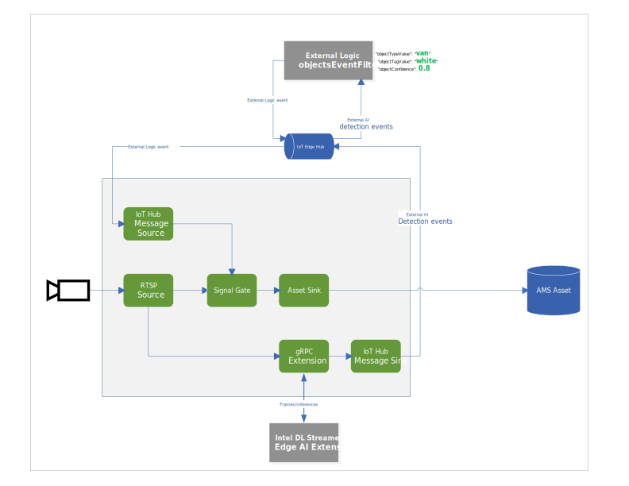

# objectsEventFilter
[Live video analytics on IoT Edge (LVA)](https://azure.microsoft.com/en-us/services/media-services/live-video-analytics/) is a new capability of Azure. LVA provides a platform for you to build intelligent video applications that span the edge and the cloud. The platform offers the capability to capture, record, analyze live video and publish the results (video and/or video analytics) to Azure services (in the cloud and/or the edge). The platform can be used to enhance IoT solutions with video analytics.

This edge module can be deployed to your IoT Edge device that runs the Live Video Analytics pipeline and trigger a recording based on certain inference attributes. While it is written to work with inference results from the Intel DL Streamer - Edge AI Extension used in [this tutorial](https://docs.microsoft.com/azure/media-services/live-video-analytics-edge/use-intel-grpc-vas-tutorial) it can also be used and modified to work with YOLO/DeepStream since the code is open source. This sample module is currently only tested to build for x64. Support for arm64 will come soon.

When you deploy this module and use the included deployment template and tolopology the pipeline will look like this:


The RTSP source will split video into a Signal Gate which will hold back the video flow and the gRPC Extension which will create images out of the video and feed to the AI Inference service. the gRPC extension will also forward the inference results to the IoT Hub sink. Using the IoT Edge message routing set in the template we forward the inference results to the objectsEventFilter module. Once the filter criteria are met as set in the deployment manifest the objectsEventFilter module will forward a signal to the Signal Gate which will start the event based recording to an Azure Media Services asset.

Sample Inference result:
```
{
      "type": "entity",
      "entity": {
        "tag": {
          "value": "vehicle",
          "confidence": 0.8907926
        },
        "attributes": [
          {
            "name": "color",
            "value": "white",
            "confidence": 0.8907926
          },
          {
            "name": "type",
            "value": "van",
            "confidence": 0.8907926
          }
        ],
        "box": {
          "l": 0.63165444,
          "t": 0.80648696,
          "w": 0.1736759,
          "h": 0.22395049
        }
 }

```

Sample attribute filter in the deployment template:
```
    "objectsEventFilter": {
      "properties.desired": {
        "objectTypeValue": "van",
        "objectTypeName": "type",
        "objectTagValue": "white",
        "objectTagName": "color",
        "objectConfidence": 0.8
      }
    }
```

Sample IoT Message that is emitted when the objectEventFilter Module has a match between the inference results and the specified filter objective in the deployment template:
```
[IoTHubMonitor] [2:05:28 PM] Message received from [nuclva20/objectsEventFilter]:
{
  "confidence": 0.8907926,
  "color": "white",
  "type": "van"
}
```

## How to prepare for deployment
1) Clone this repo to your development machine where you also have the LVA tutorials repo cloned
2) Copy/move the objectsEventFilter folder to the LVA folder live-video-analytics-iot-edge-csharp\src\edge\modules\

## Build the module image
The code sample shared here is needs to be converted into an image. This can be done using the same steps as with our [objectCounter module](https://docs.microsoft.com/azure/media-services/live-video-analytics-edge/event-based-video-recording-tutorial). Navigate to the objectsEventFilter folder in VS Code and follow [these steps](https://docs.microsoft.com/azure/media-services/live-video-analytics-edge/event-based-video-recording-tutorial#generate-and-deploy-the-iot-edge-deployment-manifest)

## Deploy the module
Now that you have the module pushed to your Azure Container Registry you can create a deployment manifest that will reference it and deploy it to your LVA IoT Edge device. A sample template is included [here](./templates/deployment.objectsEventFilter.template.json). You can create a deployment manifest off of this template. 
Pay attentention to to the bottom part of the template. This is where you specify the attribute values and confidence level to trigger on.


